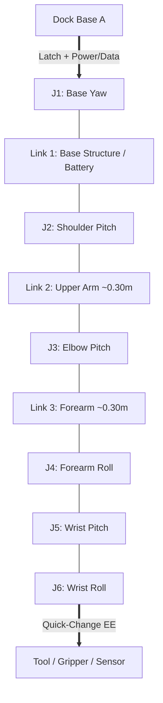
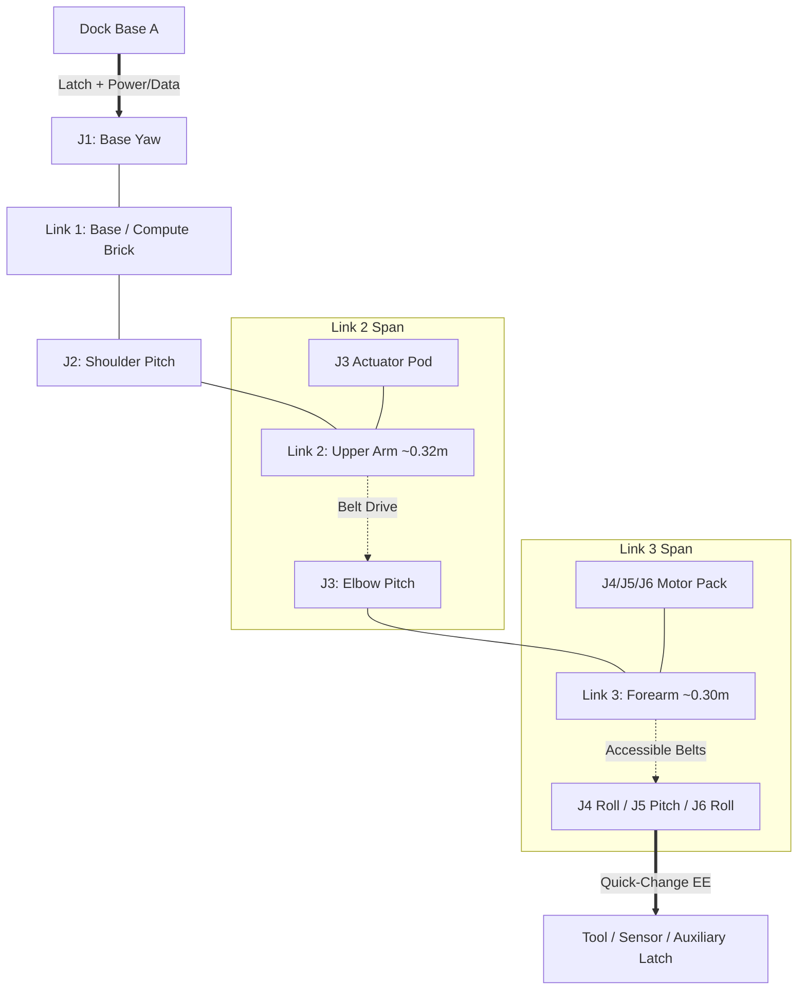
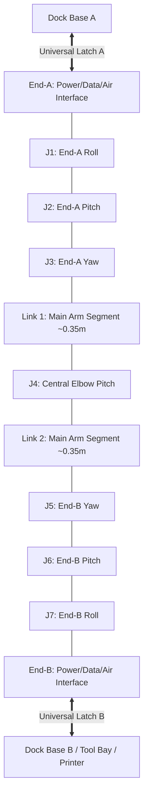

<!--
SPDX-FileCopyrightText: 2026 sint project contributors
SPDX-License-Identifier: CC-BY-SA-4.0
-->

# Candidate Kinematic Schemes — S1, S2, S3 (Task 0004 / K4)

**Status:** Draft candidate proposals for down-selection (K5)  
**Parent task:** `docs/tasks/0004-kinematic-scheme.md`  
**Normative inputs:** `docs/decisions/0003-core-numerical-characteristics.md`, `docs/decisions/0004-kinematic-survey-patterns.md`, `docs/tasks/0004-kinematic-constraints.md`, `docs/tasks/0004-placement-policy.md`

## MVP Docking Assumptions (Shared across S1/S2/S3)
Docks share a single coplanar work plane (table/rail cluster: printer + table + tool bay). Wall/ceiling/non-coplanar re-basing, biped-style climbing, and "pull-up" body-weight-class load cases are deferred and explicitly out of scope for Phase-1 scheme selection; they are not required for these schemes' Phase-1 validity. All single-step walking spacing must remain ≤ the achievable dual-dock span in a valid approach/latch pose (accounting for bent wrist/base ends and latch thickness).

---

## 1. Scheme S1 — Serial 6-DoF Modular In-Joint

### 1.1 Short Description
S1 is a classical 6-DoF articulated arm with a Roll-Pitch-Roll spherical wrist architecture (Base Yaw - Shoulder Pitch - Elbow Pitch - Forearm Roll - Wrist Pitch - Wrist Roll) composed of self-contained, modular in-joint FOC BLDC actuator pods. Each joint contains its own motor, high-ratio quiet gearbox, encoder, and local drive MCU, connected via a common CAN bus and 24 V power rail running through hollow joint centers. S1 features asymmetric ends: a heavy-duty base dock interface (Dock End) and a lightweight universal tool quick-change interface (EE End). Power architecture follows Scenario A (dock-powered operational state with an optional transit battery module mounted at the base link).

### 1.2 Joint List
| Joint ID | DoF Axis Role | Placement | Torque Class | Continuous Torque (N·m) |
| :--- | :--- | :--- | :--- | :--- |
| **J1** | Base Yaw (J1_yaw) | `in_joint` | `proximal` | ~20–25 |
| **J2** | Shoulder Pitch (J2_pitch) | `in_joint` | `proximal` | ~20–25 |
| **J3** | Elbow Pitch (J3_pitch) | `in_joint` | `proximal` | ~10–15 |
| **J4** | Forearm Roll (J4_roll) | `in_joint` | `distal` | ~3–5 |
| **J5** | Wrist Pitch (J5_pitch) | `in_joint` | `distal` | ~1–3 |
| **J6** | Wrist Roll (J6_roll) | `in_joint` | `distal` | ~1–3 |

### 1.3 Stick Diagram


### 1.4 Relocatable-Base Story
- **Sequence:** The arm operates docked at Dock A. To relocate to Dock B, the arm positions its base-segment auxiliary docking latch into direct contact with Dock B (dual-dock overlap). Once Dock B secures mechanical latching and verifies power/data integrity, Dock A releases, and the arm swings around using Dock B as its new base.
- **Cantilever Load Carrying:** Cantilever loads during stepping are carried entirely by the proximal base dock and base-segment auxiliary latch (Dock A during transit start, Dock B upon locking). The distal wrist (J4–J6) is light (~1–3 N·m) and is **never** used as a structural cantilever pivot for the main arm body; stepping relies strictly on base dual-contact / aux latch overlap.

### 1.5 EE Interface & Power Scenario
- **EE Role:** Universal quick-change mechanical + power + data (+ reserved air line) interface for assembly tools, grippers, and sensors.
- **Power Scenario:** **Scenario A** (24 V continuous from dock; optional transit battery pack mounted on Link 1 near J1/J2 to power compute/sensors and low-speed transit joints when unlatched).

### 1.6 Workspace Coverage (A1-mini + Table + Tool-Bay)
- **Reach:** Nominal arm length ~0.65 m (Upper Arm 0.30 m + Forearm 0.30 m + Wrist 0.05 m; stretch ≤ 0.80 m). Evaluated strictly against nominal 0.5–0.8 m band.
- **Dock Spacing:** 2 docks spaced ~0.5–0.6 m apart (order-of-magnitude single-step planar spacing, ≤ achievable dual-dock span in approach pose). Dock A services the Bambu Lab A1 mini bed and filament bay. Dock B services the assembly table and tool-bay cluster. Single-step reach covers both stations cleanly. Each major link (Link 2, Link 3) is split into 2 printable segments (N=2 per link ≤ 175 mm print bed limit).

### 1.7 Gate Checks & Constraint Verification
- **K1 Vetoes Passed:** V1–V8 passed. Modular pod boundaries allow individual joint swapping (DFAA). No proprietary sealed pods assumed (pattern-only quiet BLDC + FOC).
- **ADR-0004 Compliance:** Retains 6-DoF serial family. No Drop patterns (myCobot closed servos avoided; industrial harmonic drives avoided).

### 1.8 Kinematic Schema YAML
```yaml
scheme_id: S1
dof: 6
family: serial_in_joint
joints:
  - id: J1
    role: base_yaw
    placement: in_joint
    torque_class: proximal
  - id: J2
    role: shoulder_pitch
    placement: in_joint
    torque_class: proximal
  - id: J3
    role: elbow_pitch
    placement: in_joint
    torque_class: proximal
  - id: J4
    role: forearm_roll
    placement: in_joint
    torque_class: distal
  - id: J5
    role: wrist_pitch
    placement: in_joint
    torque_class: distal
  - id: J6
    role: wrist_roll
    placement: in_joint
    torque_class: distal
reach_m: [0.5, 0.8]
payload_kg: 0.5
power_scenario: A
relocatable: true
ends: asymmetric
notes: "Pure in-joint FOC modules; transit battery on Link 1; walk via base aux latch overlap"
```

---

## 2. Scheme S2 — Serial 6-DoF Cascaded Mass Bias (Default Policy)

### 2.1 Short Description
S2 is a 6-DoF serial arm designed around the Placement Policy default: cascaded actuator placement. Heavy motors for distal axes are shifted proximally toward the base of their respective structural spans. The J3 (elbow) motor is housed inside the upper-arm link (Link 2), driving J3 via a short timing belt. Motors for J4, J5, J6 (wrist assembly) are housed in the proximal end of the forearm link (Link 3), driving the lightweight wrist via short, open, agent-accessible belt/tendon channels. This drastically reduces distal inertia, enabling fast, quiet, precision assembly operations at the end-effector.

### 2.2 Joint List
| Joint ID | DoF Axis Role | Placement | Torque Class | Continuous Torque (N·m) |
| :--- | :--- | :--- | :--- | :--- |
| **J1** | Base Yaw (J1_yaw) | `in_joint` | `proximal` | ~20–25 |
| **J2** | Shoulder Pitch (J2_pitch) | `in_joint` | `proximal` | ~20–25 |
| **J3** | Elbow Pitch (J3_pitch) | `cascade` (motor in Link 2) | `proximal` | ~10–15 |
| **J4** | Forearm Roll (J4_roll) | `cascade` (motor in Link 3) | `distal` | ~2–4 |
| **J5** | Wrist Pitch (J5_pitch) | `cascade` (motor in Link 3) | `distal` | ~1–3 |
| **J6** | Wrist Roll (J6_roll) | `cascade` (motor in Link 3) | `distal` | ~1–3 |

### 2.3 Stick Diagram


### 2.4 Relocatable-Base Story
- **Sequence:** Standard relocation walk from Dock A to Dock B under Power Scenario A. The arm unlatches from Dock A only after Dock B secures mechanical and electrical locks.
- **Cantilever Load Carrying:** Because the wrist group (J4–J6) is ultralight and driven remotely by cascaded belts, it cannot withstand main arm cantilever bending loads. Stepping is executed by bringing a dedicated base-segment auxiliary docking latch into contact with Dock B (base dual-contact / aux latch), keeping all heavy cantilever moments on the main proximal joints (J1/J2) and dedicated structural latches.

### 2.5 EE Interface & Power Scenario
- **EE Role:** Universal light quick-change EE interface carrying electrical power, CAN bus, reserved air line, and low-mass F/T sensor option.
- **Power Scenario:** **Scenario A** (Dock power primary; base-mounted battery brick for un-docked transit).

### 2.6 Workspace Coverage (A1-mini + Table + Tool-Bay)
- **Reach:** Nominal 0.70 m (Link 2: 0.32 m, Link 3: 0.30 m, Wrist: 0.08 m; stretch ≤ 0.85 m). Evaluated strictly against nominal 0.5–0.8 m band.
- **Dock Spacing:** ~0.5–0.6 m center-to-center between Dock A (Printer service zone) and Dock B (Table & Tool Bay), which is within the achievable dual-dock span in a valid approach/latch pose. Low forearm inertia allows fast scanning and assembly pick-and-place cycles across both zones. All link shells segmented into 2 printable sub-blocks per link (N=2 per link ≤ 175 mm print bed limit).

### 2.7 Gate Checks & Constraint Verification
- **K1 Vetoes Passed:** V1–V8 passed. V5 specifically addressed: all timing belts and idlers run inside external snap-cover channels, allowing inspection, retensioning, and replacement by the agent without disassembling link structures.
- **ADR-0004 Compliance:** Directly implements the "Cascaded / proximal mass bias" Retain/Pattern decision.

### 2.8 Kinematic Schema YAML
```yaml
scheme_id: S2
dof: 6
family: serial_cascade
joints:
  - id: J1
    role: base_yaw
    placement: in_joint
    torque_class: proximal
  - id: J2
    role: shoulder_pitch
    placement: in_joint
    torque_class: proximal
  - id: J3
    role: elbow_pitch
    placement: cascade
    torque_class: proximal
  - id: J4
    role: forearm_roll
    placement: cascade
    torque_class: distal
  - id: J5
    role: wrist_pitch
    placement: cascade
    torque_class: distal
  - id: J6
    role: wrist_roll
    placement: cascade
    torque_class: distal
reach_m: [0.5, 0.85]
payload_kg: 0.5
power_scenario: A
relocatable: true
ends: asymmetric
notes: "Default placement policy; cascaded drives in L2/L3 with agent-accessible belt channels; walk via base aux latch overlap"
```

---

## 3. Scheme S3 — Symmetric Dual-Ended Walking Manipulator (Scaled Canadarm Logic)

### 3.1 Short Description
S3 is a 7-DoF symmetric dual-ended manipulator featuring identical, high-torque universal docking/EE interfaces on both ends. The joint topology is fully symmetric (Roll-Pitch-Yaw / Pitch / Yaw-Pitch-Roll: End-A Roll, End-A Pitch, End-A Yaw, Central Elbow Pitch, End-B Yaw, End-B Pitch, End-B Roll), allowing either end to serve as the stationary base or the active end-effector. Both terminal joint clusters (J1–J3 and J5–J7) carry high-torque proximal-class actuators so that either end can support full cantilever arm loads during relocatable walking. S3 natively operates under Power Scenario B (dock-only continuous power with dual-dock hot-handoff reconnection).

### 3.2 Joint List
| Joint ID | DoF Axis Role | Placement | Torque Class | Continuous Torque (N·m) |
| :--- | :--- | :--- | :--- | :--- |
| **J1** | End-A Roll (J1_roll) | `in_joint` | `proximal` | ~20–25 |
| **J2** | End-A Pitch (J2_pitch) | `in_joint` | `proximal` | ~20–25 |
| **J3** | End-A Yaw (J3_yaw) | `in_joint` | `proximal` | ~15–20 |
| **J4** | Central Elbow Pitch (J4_pitch) | `in_joint` | `proximal` | ~10–15 |
| **J5** | End-B Yaw (J5_yaw) | `in_joint` | `proximal` | ~15–20 |
| **J6** | End-B Pitch (J6_pitch) | `in_joint` | `proximal` | ~20–25 |
| **J7** | End-B Roll (J7_roll) | `in_joint` | `proximal` | ~20–25 |

### 3.3 Stick Diagram


### 3.4 Relocatable-Base Story
- **Sequence:** Pure inchworm / walking-arm locomotion. End-A is locked in Dock A. End-B reaches Dock B and establishes mechanical latching and electrical hot-handoff. Once Dock B takes over power supply and control communication, End-A releases from Dock A. The arm is now rooted at Dock B, with End-A becoming the active manipulator end.
- **Cantilever Load Carrying:** Cantilever loads during stepping are carried directly by the terminal joint modules (J5–J7 when rooted at Dock B; J1–J3 when rooted at Dock A). Because both ends feature full proximal-class torque (~20–25 N·m), no extra structural auxiliary latches or wrist-bypass mechanisms are required.

### 3.5 EE Interface & Power Scenario
- **EE Role:** Symmetric dual-role terminal interfaces. Both End-A and End-B contain identical high-current dock latches, CAN bus pins, quick-change tool interfaces, and pneumatic pass-throughs.
- **Power Scenario:** **Scenario B** (Dock-only power with dual-dock hot-handoff reconnection; no onboard transit battery needed).

### 3.6 Workspace Coverage (A1-mini + Table + Tool-Bay)
- **Reach:** Nominal 0.80 m (Link 1: 0.35 m, Link 2: 0.35 m, End clusters: 0.10 m total; stretch ≤ 1.0 m). Scorecard evaluation uses the nominal 0.5–0.8 m range.
- **Dock Spacing:** ~0.6–0.7 m single-step planar spacing (≤ achievable dual-dock span in approach/latch pose). Extended spacing (~0.8–1.0 m) is qualified as requiring a fully stretched pose or multi-step walking across intermediate coplanar docks. Printable link shells are split into 2–3 segments per link (N=2–3 per link ≤ 175 mm print bed limit).

### 3.7 Gate Checks & Constraint Verification
- **K1 Vetoes Passed:** V1–V8 passed. Satisfies R2 (relocatable base) natively without secondary support fixtures.
- **ADR-0004 Compliance:** Implements "Relocatable base / walking-arm logic (scaled Canadarm pattern)" Retain/Pattern decision. 
- **Scorecard Flag for K5:** Carrying seven proximal-class joints (J1–J7) provides full walk capability, but adds significant component cost (N7 risk) and higher terminal mass when an end acts as the active EE. This will be penalized under mass/cost metrics in K5, though it remains fully valid under R2.

### 3.8 Kinematic Schema YAML
```yaml
scheme_id: S3
dof: 7
family: dual_ended_symmetric
joints:
  - id: J1
    role: end_a_roll
    placement: in_joint
    torque_class: proximal
  - id: J2
    role: end_a_pitch
    placement: in_joint
    torque_class: proximal
  - id: J3
    role: end_a_yaw
    placement: in_joint
    torque_class: proximal
  - id: J4
    role: elbow_pitch
    placement: in_joint
    torque_class: proximal
  - id: J5
    role: end_b_yaw
    placement: in_joint
    torque_class: proximal
  - id: J6
    role: end_b_pitch
    placement: in_joint
    torque_class: proximal
  - id: J7
    role: end_b_roll
    placement: in_joint
    torque_class: proximal
reach_m: [0.6, 1.0]
payload_kg: 0.5
power_scenario: B
relocatable: true
ends: dual_ended
notes: "Symmetric Canadarm-style walking arm; dual high-torque ends support full cantilever walk; Scenario B hot-handoff; high BOM/mass trade-off for K5"
```
