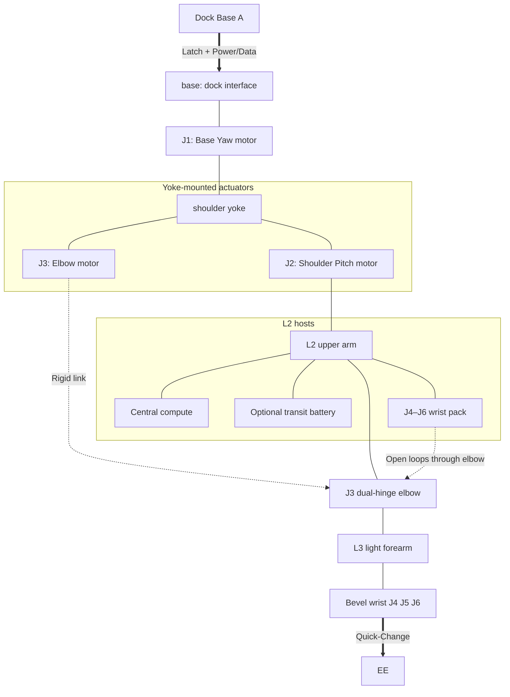

<!--
SPDX-FileCopyrightText: 2026 sint project contributors
SPDX-License-Identifier: CC-BY-SA-4.0
-->

# Candidate Scheme S4 — LIMS-inspired serial arm (Task 0005 / C1b.4)

**Status:** Draft candidate for S2 vs S4 gate (C1b.5) — **not** a replacement for ADR-0005  
**Parent:** `docs/tasks/0005-component-composition.md` (C1b), ADR-0006  
**Normative inputs:** ADR-0003, ADR-0005 (S2 remains baseline until gate), ADR-0006, placement policy, K1 constraints,  
`docs/tasks/0005-lims-elbow-onepager.md`, `docs/tasks/0005-lims-n1-to-2n-onepager.md`,  
`docs/references/lims-family-notes.md`

## MVP docking assumptions (same as S1–S3)

Docks share a **single coplanar** work plane (printer + table + tool bay). Wall/ceiling climb and body-weight pull-up loads are out of Phase 1. Single-step dock spacing must stay ≤ achievable dual-dock span in a valid approach/latch pose.

**S4 intent:** approach **LIMS-class** dynamics (light distal, fold, dock-neighbourhood workspace, quiet motion) under **ADR-0003 bands** and **DFAA-accessible** transmissions — **not** a clone of LIMS-EX mass, payload, or sealed cable trees.

---

## 4. Scheme S4 — Serial 6-DoF LIMS-inspired (proximal packs + dual-hinge elbow)

### 4.1 Short description

S4 is a **6-DoF serial** arm that borrows LIMS-family *principles*:

- **Proximal mass centering:** shoulder and elbow actuators at the **base / shoulder fork**; **wrist drive pack on the upper arm** (not in the forearm).
- **Dual-hinge elbow (1 DoF effective):** two synchronized hinges for deep fold and **length-decoupled** cable/belt paths through the elbow (see elbow one-pager).
- **Wrist 3-DoF** driven by **short, open, agent-serviceable** cable or belt loops through the elbow; optional **single accessible pretension** inspired by N+1-to-2N (consumer subset only — see N+1-to-2N one-pager).
- **Asymmetric ends** and **Power Scenario A** (same relocatable story as S2: base aux-latch walk; wrist not a hoist).
- **Collinear / symmetric link load paths** preferred (reduce parasitic bending on joints), within printable segment limits.

Forearm and wrist structure stay **minimal mass**. Exact bevel vs belt differential at the wrist is left open at stick level.

**Structural stack (Phase 1 naming):**
- **base** — dock latch + connectors only (no main compute/battery here).
- **J1** — yaw actuator between base and **shoulder yoke**.
- **shoulder yoke** — carries **J2** (pitch) and **J3** (elbow) motors.
- **upper arm (L2)** — on J2 output: **central compute**, **optional transit battery**, **wrist motor pack**, open transmission runs toward elbow.
- **dual-hinge elbow (J3)** — driven from yoke-mounted J3 motor via **rigid push-pull link**.
- **forearm (L3)** — light structure only (no wrist motors).
- **wrist** — **3-DoF bevel differential**, cable/belt from upper-arm pack through decoupled elbow path.

### 4.2 Joint list

| Joint ID | DoF axis role | Placement | Torque class | Continuous torque (N·m) |
|----------|---------------|-----------|--------------|-------------------------|
| **J1** | Base yaw | `in_joint` on **base** → drives **yoke** | `proximal` | ~10–25 |
| **J2** | Shoulder pitch | `in_joint` on **yoke** → drives **L2** | `proximal` | ~10–25 |
| **J3** | Elbow pitch (dual-hinge, 1 DoF) | motor on **yoke**; output via **rigid link** to dual-hinge | `proximal` | ~5–15 |
| **J4** | Wrist axis A (bevel set) | motors on **L2** (upper arm); through-elbow media | `distal` | ~1–5 |
| **J5** | Wrist pitch | same pack on **L2** | `distal` | ~1–5 |
| **J6** | Wrist roll | same pack on **L2** | `distal` | ~1–5 |

**Notes**

- Logical 6-DoF serial chain; wrist axis naming may follow differential bevel (pitch/yaw/roll) without changing family.
- J3 **output** is one angle; **mechanism** is dual-hinge + 1:1 sync.
- No seventh arm DoF required for Phase 1 S4 (gripper actuator, if any, is EE-side).

### 4.3 Stick diagram



ASCII (optional):

```text
[Dock]—J1—[L1]—J2—[L2: wrist pack + elbow motor path]—J3(dual)—[L3 light]—J4/J5/J6—[EE]
                \________________________________/ 
                 through-elbow open transmissions
```

### 4.4 Relocatable-base story

- **Sequence:** Same planar dual-dock walk as S2. Latch Dock B (base / aux structure) before releasing Dock A under Scenario A.
- **Cantilever loads:** Carried by **base dock + auxiliary base latch** and proximal structure (J1/J2). **Wrist and light forearm are not** the structural hoist for the arm body (same rule as S2).
- **S4 extra:** Deep elbow fold improves **approach geometry** to the second dock and to service points around the occupied dock (perimeter / slightly below plane when edge-mounted) without requiring dual-ended S3.

### 4.5 EE interface and power scenario

- **EE role:** Light quick-change: power + data + reserved air; optional low-mass F/T.
- **Power:** **Scenario A** — dock-powered work. Ends **asymmetric** (base-dense vs EE-light).
- **Utilities:** Power/data along arm; air reserved; routing must not block open tensioner access.
- Optional transit battery and central compute live on **upper arm (L2)**, not on the dock base block.
- Base carries only dock power/data path into the arm; distribution continues across J1 slip/routing as designed later.

### 4.6 Workspace coverage (A1-mini + table + tool-bay)

- **Reach:** Target **0.5–0.8 m** class (stretch ≤ ~0.85–1.0 m only as research margin — not LIMS 5 kg / 1 m payload copy).
- **Dock spacing:** Single-step **~0.5–0.6 m** centers, ≤ dual-dock span in approach pose (bent ends + latch stack).
- **Differentiator vs S2:** Same numeric reach band; **better fold and dock-neighbourhood** dexterity from dual-hinge elbow + lighter forearm (no J4–J6 motor pack in L3).
- **Print envelope:** Major shells segmented ≤ ~175–180 mm; dual-elbow intermediate body is its own printable module.

### 4.7 Gate checks and constraint verification

| Check | S4 claim |
|-------|----------|
| ADR-0003 payload / torque / BOM / N6 intent | Targets stay in N3–N7 bands; no ÷10 scaling from LIMS 5 kg |
| DFAA V5 (serviceable transmission) | **Mandatory:** open covers on upper-arm pack, elbow rollers, pretension slider/turnbuckle; no opaque full-arm cable tree |
| ADR-0004 | Remote/cable = pattern; S4 uses **accessible** subset only |
| ADR-0006 | Explicit LIMS-inspired candidate |
| Drop patterns | No sealed proprietary pods as only path; no industrial-only harmonics as default |
| K1 planar docks | Pass — same coplanar MVP as S1–S3 |

**Explicit non-goals for this draft:** full LIMS-EX N+1-to-2N topology freeze; quaternion wrist as required; custom frameless motors; Scenario B dual-ended symmetry (that remains S3).

### 4.8 Kinematic schema YAML

```yaml
scheme_id: S4
dof: 6
family: serial_lims_inspired
status: candidate_parallel_to_S2
structure:
  base: dock_interface_only
  yoke: on_J1_rotor   # carries J2, J3 motors
  L2_upper_arm: on_J2_output  # compute, optional battery, wrist pack
  L3_forearm: light
  wrist: bevel_3dof
joints:
  - id: J1
    role: base_yaw
    placement: in_joint_on_base
    drives: shoulder_yoke
    torque_class: proximal
  - id: J2
    role: shoulder_pitch
    placement: in_joint_on_yoke
    drives: L2_upper_arm
    torque_class: proximal
  - id: J3
    role: elbow_pitch_dual_hinge
    placement: motor_on_yoke_rigid_link
    mechanism: dual_hinge_1to1_sync
    torque_class: proximal
  - id: J4
    role: wrist_bevel_a
    placement: pack_on_L2_through_elbow
    torque_class: distal
  - id: J5
    role: wrist_pitch
    placement: pack_on_L2_through_elbow
    torque_class: distal
  - id: J6
    role: wrist_roll
    placement: pack_on_L2_through_elbow
    torque_class: distal
transmission:
  elbow_drive: rigid_link
  wrist_media: open_cable_or_belt_via_decoupled_elbow
  wrist_mechanism: bevel_differential_3dof
  pretension: TBD_at_CAD
  elbow_cable_decoupling: required_if_through_elbow
reach_m: [0.5, 0.8]
payload_kg: 0.5
power_scenario: A
relocatable: true
ends: asymmetric
walk: base_aux_latch_planar
compute_location: L2_upper_arm
battery_location: L2_upper_arm_optional
references:
  - docs/tasks/0005-lims-elbow-onepager.md
  - docs/tasks/0005-lims-n1-to-2n-onepager.md
  - docs/references/lims-family-notes.md
notes: >
  LIMS-inspired: proximal packs, dual-hinge elbow, light forearm,
  accessible through-elbow transmissions; not LIMS-EX scale or sealed routing.
```

### 4.9 Decisions locked for this candidate (C1b.4)

1. **Wrist mechanism:** bevel-gear differential (3 DoF) at wrist; driven from L2 pack.
2. **Elbow drive:** rigid push-pull link from yoke-mounted J3 motor to dual-hinge elbow.
3. **Wrist DoF in MVP scope for S4 study:** full **3 DoF** (not deferred to 2 DoF).
4. **Pretension:** implementation **open until CAD** (manual turnbuckle vs slider vs elbow-coupled compensation — choose in detailed design).
5. **Inertia OOM vs S2:** move S2 forearm wrist-pack mass onto **L2 (upper arm)** near elbow; optional factor **~1.1–1.3×** for sliders/pretension hardware if present. Same class of hardware may appear in refined S2 cascade — flag in C1b.5, do not double-count ideology.

### 4.9b Still open (not blocking C1b.4)

- Exact bevel sizing and cable vs belt media
- J1 power/data routing detail (slip ring vs cable coil vs limited yaw)
- Print split of yoke vs L2 shells

---

## Document control

| Item | Value |
|------|--------|
| Closes | C1b.4 draft |
| Does not close | C1b.5 scorecard, C1b.6 gate, ADR-0005 amendment |
| Next | `docs/tasks/0005-s2-vs-s4-scorecard.md` (C1b.5) |
